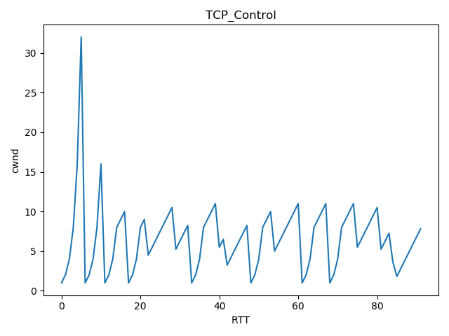
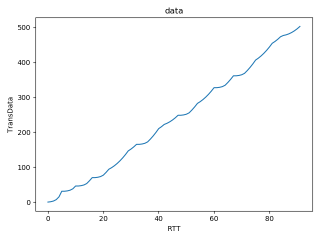

###### 2017301530080 王润泽

---

TCP拥塞控制模拟代码如下：

```
import random
from matplotlib import pyplot as plt
ssthresh = 64
cwnd = 1
data = 0 #已传输数据
sum_data = 0 #总共需要传输的数据
cwnds = [1] #记录cwnd的变化
datas = [0] #记录数据传输的变化
def isCrowd(cwnd):
    rate=cwnd*1.5 #假设发生拥塞的概率为cwnd*1.5
    if random.randint(0,99)<rate:
        if random.randint(0,99)<50:
            return "time_out" # 50%概率超时
        else:
            return "ACK"  # 50%概率快重传
    return "OK"
def Start():
    global data, cwnd, ssthresh, cwnds, sum_data
    isSlowStart = True
    if cwnd >= ssthresh:# 拥塞避免
        isSlowStart = False
    is_crow = isCrowd(cwnd)
    if is_crow == 'OK': # 未拥塞
        data += cwnd
        if isSlowStart:
            cwnd *= 2
        else:
            cwnd += 1
    elif is_crow == 'time_out': #超时
        ssthresh = cwnd/2
        cwnd=1
    elif is_crow == 'ACK': #快重传
        data += cwnd
        ssthresh = cwnd/2
        cwnd = ssthresh
    else:
        return
    cwnds.append(cwnd)
    datas.append(data)
    if data>=sum_data:
        return
    Start()

def showcwnd():
    plt.title("TCP_Control")
    plt.xlabel("RTT")
    plt.ylabel("cwnd")
    x=range(len(cwnds))
    plt.plot(x, cwnds)
    plt.show()
def showdata():
    plt.title("data")
    plt.xlabel("RTT")
    plt.ylabel("TransData")
    x=range(len(datas))
    plt.plot(x, datas)
    plt.show()
if __name__ == "__main__":
    print("请输入总共需要传输的数据量")
    sum_data=int(input())
    Start()
    showcwnd()
    showdata()
```

在程序中，我设置的发生拥塞的概率为当前cwnd值的1.5倍，ssthresh设置为64，在发生拥塞时，有50%概率是超时，50%概率是快重传。

运行结果如下：（假设要传输500报文段的文件）


cwnd的变化图如下



数据传输过程如下图



