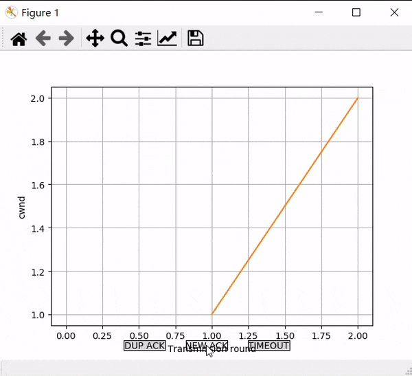

## TCP拥塞控制-python实现

```python
from matplotlib import pyplot as plt
from matplotlib.widgets import Button
from PIL import Image
import numpy as np

# matplotlib画图
def draw():
    x = []
    for i in range(len(cwnd_array)):
        x.append(i+1)
    axe.plot(x, cwnd_array)
    fig.canvas.draw()


# dupACKcount++
def dup_ACK(event):
    tcpcc.add_dup_ack()
    draw()
    print('dupACKcount = ', tcpcc.dupACKcount)


# timeout
def let_timeout(event):
    tcpcc.timeout()
    draw()


# new ACK
def new_ack(event):
    tcpcc.new_ack()
    draw()


# 画按钮
def draw_button():
    global ack_btn, timeout_btn, new_ack_btn  # must global
    ack_point = plt.axes([0.3, 0.03, 0.1, 0.03])
    ack_btn = Button(ack_point, "DUP ACK")
    ack_btn.on_clicked(dup_ACK)

    new_ack_point = plt.axes([0.45, 0.03, 0.1, 0.03])
    new_ack_btn = Button(new_ack_point, "NEW ACK")
    new_ack_btn.on_clicked(new_ack)

    timeout_point = plt.axes([0.6, 0.03, 0.1, 0.03])
    timeout_btn = Button(timeout_point, "TIMEOUT")
    timeout_btn.on_clicked(let_timeout)


# TC拥塞控制类
class TCP_C_C:
    def __init__(self):
        self.cwnd = 1
        self.ssthresh = 64
        self.dupACKcount = 0
        self.state = '慢启动'  # 状态分为：慢启动、拥塞避免、快恢复
        cwnd_array.append(self.cwnd)

    # 增加一个ACK重复的
    def add_dup_ack(self):
        if self.state == '快恢复':
            self.cwnd = self.cwnd + 1
        else:
            self.dupACKcount = self.dupACKcount + 1
            if self.dupACKcount == 3:
                self.ssthresh = self.cwnd / 2
                self.cwnd = self.ssthresh + 3
                self.state = '快恢复'
                cwnd_array.append(self.cwnd)

    # 超时
    def timeout(self):
        self.ssthresh = self.cwnd / 2
        self.cwnd = 1
        self.dupACKcount = 0
        self.state = '慢启动'  # 状态分为：慢启动、拥塞避免、快恢复
        cwnd_array.append(self.cwnd)

    # new ACK
    def new_ack(self):
        if self.state == '慢启动':
            self.cwnd = self.cwnd * 2
            self.dupACKcount = 0
            if self.cwnd >= self.ssthresh:
                self.state = '拥塞避免'
        elif self.state == '拥塞避免':
            self.cwnd = self.cwnd + 1
            self.dupACKcount = 0
        elif self.state == '快恢复':
            self.cwnd = self.ssthresh
            self.dupACKcount = 0
            self.state = '拥塞避免'
        cwnd_array.append(self.cwnd)


if __name__ == "__main__":
    cwnd_array = []  # 纵坐标
    tcpcc = TCP_C_C()
    fig = plt.figure()
    draw_button()
    axe = fig.add_subplot(111)
    axe.plot(cwnd_array)
    plt.xlabel('Transmission round')
    plt.ylabel('cwnd')
    plt.grid()
    plt.show()

```

运行结果如下：

